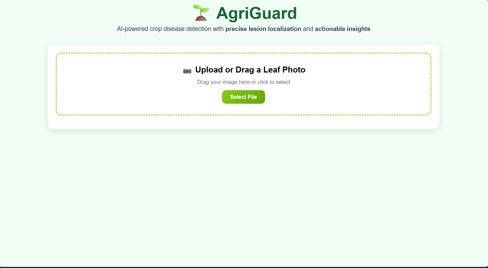
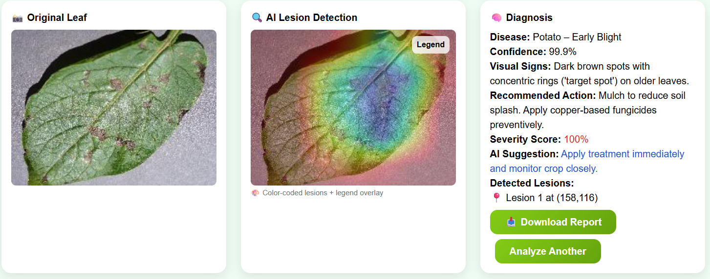

# 🌱 AgriGuard – AI-Powered Crop Disease Diagnostic

[](https://halothon-2025.devpost.com/)
[](https://python.org)
[](https://tensorflow.org)
[](https://flask.palletsprojects.com)

> **AgriGuard** is an AI-powered diagnostic tool that detects crop diseases in maize, tomato, and potato using a custom-trained deep learning model.  
> It provides **precise lesion localization**, **disease-specific color overlays**, **severity scoring**, and **AI treatment recommendations** — all within a clean, agricultural-themed dashboard.

Built for **[Halothon 2025](https://halothon-2025.devpost.com/)** — the global AI hackathon.

---

## 🌾 Features

- ✅ **Custom CNN model** trained on **24,000+ images** from the PlantVillage dataset  
- ✅ **13 disease classes** across **maize, tomato, and potato**  
- ✅ **Explainable AI**: color-coded overlays show diseased regions clearly  
- ✅ **AI Severity Scoring**: quantifies how much of the leaf is affected  
- ✅ **Actionable AI Suggestions**: context-aware remedies based on severity  
- ✅ **Auto-generated PDF Report**: download full diagnosis and recommendations  
- ✅ **Interactive Dashboard**: drag-and-drop upload, collapsible legend, scrollable view  
- ✅ **Agricultural UI Theme**: lime green + sky blue, inspired by nature  
- ✅ **Offline-Ready**: runs locally on any computer with Python  

---

## 🖼️ Demo

https://github.com/user-attachments/assets/8f3a7c9d-1b2e-4f3a-9f1c-8e4a5b6d7c8e  

> *Left: Original leaf | Right: AI-detected lesions with severity visualization*

---

## 📸 Screenshots

| Dashboard | Diagnosis Report |
|------------|------------------|
|  |  |

> *Interactive dashboard with agricultural theme (left) and PDF report output (right).*

---

## 🚀 Quick Start

### Prerequisites
- Python 3.8+
- `pip`

### Installation

1. Clone this repo:
   ```bash
   git clone https://github.com/your-username/agriguard.git
   cd agriguard
   ```

2. Install dependencies:
   ```bash
   pip install tensorflow opencv-python flask pillow numpy fpdf
   ```

3. Place your trained model (`agriguard_model.h5`) in the project root.  
   *(Or [download a sample model](#model-training) to test.)*

4. Run the app:
   ```bash
   python app.py
   ```

5. Open your browser and navigate to:  
   🔗 `http://localhost:5000`

---

## 🧠 Model Training (Optional)

AgriGuard’s model was trained using **MobileNetV2** on the [PlantVillage dataset](https://www.kaggle.com/datasets/emmarex/plantdisease), covering:

* **Maize**: Northern Leaf Blight, Common Rust, Cercospora Leaf Spot, Healthy  
* **Tomato**: Late Blight, Early Blight, Bacterial Spot, Septoria, Yellow Leaf Curl Virus, Healthy  
* **Potato**: Late Blight, Early Blight, Healthy  

A training script (`train_model.py`) is included for retraining or fine-tuning.

---

## 🧩 Tech Stack

**Frontend:** HTML, CSS (Tailwind), JavaScript  
**Backend:** Flask (Python)  
**AI Model:** TensorFlow (MobileNetV2)  
**Visualization:** OpenCV, NumPy  
**PDF Generation:** FPDF  

---

## 📦 Project Structure

```
agriguard/
├── app.py                 # Main Flask dashboard
├── agriguard_model.h5     # Trained AI model
├── train_model.py         # Model training script (optional)
├── prepare_data.py        # Dataset organizer
├── static/                # Images, icons, assets
├── templates/             # HTML templates
└── README.md
```

---

## 🌱 Future Enhancements

- [ ] Support for more crops (e.g., cassava, wheat, beans)  
- [ ] Real-time webcam leaf analysis  
- [ ] Cloud sync for farmer analytics dashboards  
- [ ] Multi-language support (English, Swahili, Chichewa)  
- [ ] Mobile version for offline Android use  

---

## 🏆 Built for Halothon 2025

**Theme:** AI for Agriculture & Sustainability  

### 🧮 Judging Criteria Addressed
- ✅ **Best Use of AI** – custom model + explainable lesion mapping  
- ✅ **UI/UX Excellence** – intuitive and accessible agricultural dashboard  
- ✅ **Impact** – practical insights for smallholder farmers  
- ✅ **Technical Depth** – on-device inference + dynamic PDF reporting  

---

## 📹 Demo Video

[](https://youtu.be/your-video-id)

*(Replace with your YouTube link before submission)*

---

## 🌍 Why It Matters

Over **40% of global crop yields** are lost to disease each year — especially in developing regions.  
AgriGuard empowers farmers with **instant, offline diagnostics** using just a smartphone or laptop — no internet or agronomist required.

---

## 📜 License

MIT License – free to use, adapt, and deploy for agricultural good.

---

> **🌾 “The best time to protect your crops is before disease spreads.”**  
> — *AgriGuard helps you act early, precisely, and sustainably.*
